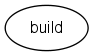
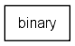
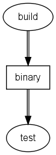
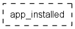
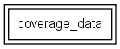

# Execution Graph

This document describes the SoftFab way of modeling your build and test process.

TODO: The used images should be framed.

## Introduction

A project that is developing a piece of software typically keeps the source code in a configuration management system. There is a build that compiles the source code to create a binary. The binary is then subjected to a series of tests. Some projects also extract API documentation from the source code or run a static code analysis on it. Binaries are often packaged in a format that makes them easier to deploy (package or installshield). All these operations are part of the build and test process of a project.

In this document we will introduce a graphical language to describe the build, test and reporting process. This language is used by the SoftFab Control Center to visualize the process, but it is also very useful on paper or white boards when designing or discussing the process. A graphical presentation of (part of) a process in this language is called an _execution graph_.

To make the process manageable, we cut it into smaller pieces. For example the build would become one piece, each test suite another piece etc. These pieces are connected: a test can only run after the build, since it needs the binary produced by the build. These dependencies are essential in the SoftFab way of modeling a process: the user tells SoftFab the process actions and their dependencies and SoftFab will figure out in what order the actions have to be run and will run as many actions as possible in parallel.

## Elements

### Framework

A _framework_ is the smallest unit of work that can be done by the factory. The Control Center assigns a task to a Task Runner which then runs the wrapper defined by the framework to completion. Examples of frameworks are: getting the latest version from CM system, performing static code checking, performing a build, generating documentation or running a test suite.

The graphical presentation of a framework is the name of the framework inside an oval:

### Product

A _product_ is the input or output of a framework. A framework cannot start until all its input products are available.

The graphical presentation of a product is the name of the product inside a rectangle:

Reports and log files produced while executing the wrapper defined by the framework are typically not modeled as a product, since there are no other tasks that depend on them; they are intended for human consumption. For every framework that runs in SoftFab there is at least one log: the Task Runner log. Which other reports and logs are available is determined by the wrapper.

### Dependencies

The output product of one framework can be the input product for another framework, for example a test run task takes as its input a binary which is the output of a build task. So dependencies between frameworks (tasks) are modeled by shared products.

The graphical presentation of a framework producing or consuming a product is a double lined arrow:

The execution graph specifies which output products a framework can potentially produce. It is not possible for a framework to produce an output that was not declared. It is possible though that a framework does not produce all of its declared outputs. For example if there is a compilation error in the build framework, no binary will be produced.

### Product Properties

This section describes a few product properties that are relevant to the design of the execution graph.

#### Token Product

Often a product is a file or set of files, for example a directory tree containing source code. Or a product can be an identifier of some kind, such as a label in a CM system. The path or URL of the file (set) or the identifier string is called the _locator_ of the product.

In some cases a product signals that a certain state has been reached, without any files being produced and without any associated identifier. In other words, such a product does not have a locator. For example, one framework might install an application on a PC or device and another framework will run tests on the installed application. The product between these two tasks signals that the installation succeeded, but does not carry any additional information. We call products like this _token products_.

A token product is presented as the name of the product inside a dashed rectangle:

#### Local Product

By default, a product is assumed to be accessible by every Task Runner in the factory. This is true if the product is for example a file on a web server or on a network drive available to all project PCs. However, sometimes a product is bound to a particular Task Runner, for example files on the local harddisk of the Factory PC. Such a product is called a _local product_.

The use of a local product can sometimes simplify the implementation of wrappers. It can also lead to better performance in some cases: for example building on a local harddisk is often a lot faster than building on a network drive. However, it also limits the ability of SoftFab to execute tasks on different Task Runners, thus reducing parallelism and increasing lead time. So we recommend looking at your execution graph when deciding whether a product should be local or not: if a product is an input to a lot of tasks, you should try to avoid making it local.

#### Combined Product

Sometimes a task has to gather the output of several other tasks, for example a combined test report generated from the test results of several test tasks. The final report task should not run until all test tasks have finished. For these situations the _combined product_ was introduced.

A combined product is presented as the name of the product inside a double rectangle:

A combined product differs from a non-combined product in whether and when it is considered available to the frameworks consuming it:

What happens? | Non-combined Product | Combined Product
-----|-----|-----
The consuming framework starts... | when the first framework produces the product. | when all potential producers have finished.
If no framework produces the product... | the consuming framework is cancelled. | the consuming framework is executed.

If a non-combined product has more than one producer, the product is considered available as soon as at least one producer has produced the product; it does not matter which producer that is. In contrast, a combined product will not be considered available before all potential producers have finished.

If a non-combined product is not produced by any of its potential producers, it is considered permanently unavailable and tasks depending on it are cancelled. For example, no tests are run if the build fails. In contrast, availablity of a combined product does not depend on how many potential producers actually produced it. So if all test tasks failed to produce test results due to a problem in the test setup, the final task that makes the combined report will run and generate a report stating that all tests failed to deliver their results.

## Execution Graph Design

### Granularity

The execution of a typical build or test consists of the following steps:

*   Prepare the working environment
*   Invoke the framework
*   Postprocess the results

You should decide how to model these steps as tasks in SoftFab. It's possible to do everything in a single task. This is the easiest way, but sometimes there are advantages to splitting it into multiple tasks.

Imagine you're doing a build which consists of the following steps:

1.  Get the source code from configuration management
2.  Invoke Make on the top-level Makefile
3.  Postprocessing: create a summary report containing all the warnings the compiler issued

If you later want to add static code checks (e.g. Lint, QAC, JTest, etc.) or documentation extraction (Doxygen, JavaDoc, etc.) it would make sense to split the execution into two frameworks:

<dl>
  <dt>export:</dt>
  <dd>Get the source code from configuration management (step 1)</dd>
  <dt>build:</dt>
  <dd>Invoke Make and postprocess the logging (step 2 and 3)</dd>
</dl>

The advantage of having a separate "export" framework is that you can use that same "export" framework for the static code check or documentation extraction. This means you avoid duplication of code in your framework wrappers, making them easier to maintain. It also means that a job which contains a build and a static code check and a documentation extraction will only take the sources from configuration management once, instead of three times, so the job will run faster and put a lower load on your CM server.
