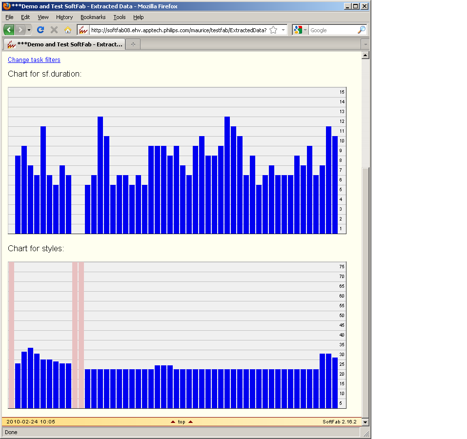

# Mid-level Data

All kind a metrics about a task execution can be gathered. Typically you are not interested in the top-level result (did the test succeed) or in the tiny details (which tests did exactly succeed) but you like an overview of meta data defined by you. SoftFab will store this data and offers you ways to view trends and to export this data.

<p class="todo">TODO: Update example image at the end.</p>

## Reporting Levels

When a build or test is run, reports are produced. For a build, such a report would be a build log that lists the warnings and errors reported by the compiler. A unit test produces the main test report, but could also produce coverage information.

There are different levels at which reports can be made. Depending on what information the user needs, he will want to look at a different level. For example, a developer who wants to fix a bug and wants very detailed information from the test that triggers the bug. However, a manager who wants to know if the project is on track will not want to see each individual problem that was found, but aggregate numbers and trends.

In SoftFab, we distinguish three levels of reporting:

low
:   The most detailed level of reporting that the build/test tool can produce. It is intended to help the user to fix individual problems. It is not worthwhile to store this reporting in a format suitable for automatic comparison to other reports. Examples: build log; a report containing the computed values, logging, exception traces, etc. of single test cases.

middle
:   Data at this level can be automatically compared between different runs of the same task. The data can have a lot of detail or it can be aggregated. Examples: the number of warnings and errors in a build; the result code (pass, fail, error) for each test case in a unit test, lines of code, number of violations, etc.

high
:   The least detailed level of reporting. This level contains only the data which is essential for the Control Center to handle a task. Examples: the result code (ok/warning/error); the summary string; the locators of the produced products.

You may have noticed we define a level in terms of what operations we want to perform on the reporting, rather than on what type of reporting it is. This is intentional: for one project results of individual test cases may be too detailed to consider them mid-level, while for another project comparing individual test cases between task runs is a very valuable feature. It is even possible that a project starts out with a small or empty middle level, but as time progresses more reporting is moved from low-level to mid-level by writing the necessary extraction/conversion tools.

## Extraction

To be able to generate mid-level reports, useful mid-level data has to be extracted from task runs. SoftFab stores the mid-level data as key-value pairs, where the keys and the values are arbitrary strings. Some types of reporting, such as bar charts, are only available for values that consist of numbers though. Although keys can be chosen freely, the same key should have the same meaning for all runs of particular task in order for the different runs to be compared in a meaningful way,

_Extraction_ is the process of getting the mid-level data out of a task run. Either the build or test framework can be modified to output the mid-level data key-value pairs, or a post processor can be made to extract the reporting from the framework's native format (the low-level reporting). For open source frameworks both approaches are possible, but for closed source frameworks post processing is the only option.

Mid-level data extraction can be done either in the execution wrapper or in a separate extraction wrapper (shadow task). In the latter case, the existence of an extraction wrapper must be declared in the framework definition on the Control Center. In both cases the key-value pairs are written to the results file using the following syntax:

```python
data.<key>=<value>
```

See the [Passing Results](../../installation/wrappers/writing_a_wrapper/#passing-results) section of the Writing a Wrapper document for a full description of the results file.

## How to extract mid-level data?

It depends what type of file is generated by the tool. The easiest way to extract data from a low-level report is if it is an XML file, because the required data fields can be found easily (XML tags). If the report is a text output or HTML output it is more difficult to parse and filter the required data.

After the XML low-level report has been created by the tool, an extra step has to be executed from the wrapper script to extract the mid-level data from the XML file. An XML parser or filter can be used, or an XSL stylesheet filter can be used. The NAnt script language has built-in XSLT processing, Python also support XSLT processing (lxml), otherwise a stand-alone tool called: 'xsltproc' can be used from any script-language (read more about the 'xsltproc' tool on this [website](http://www.sagehill.net/docbookxsl/InstallingAProcessor.html)). Some examples of XML mid-level data extraction can be found in the [Shared Wrappers](../../installation/wrappers/shared_wrappers) section. E.g. the 'cppcheck' wrapper contains an XSL stylesheet (cppcheck.xsl) to extract data from the low-level cppcheck XML file to generate an HTML report and another XSL stylesheet (cppcheck-results.xsl) to extract the mid-level data (key-value) pairs and to compile the 'summary' string.

To extract data from HTML or text files can be done by using commands such as 'grep' or 'wc' (Linux, Cygwin), or by a self-written filter script (e.g. in Perl or Python).

## Viewing Trend Graphs

For all tasks, SoftFab always collects the duration (in seconds). Next you can collect other data. With the collected mid-level data, SoftFab can generate mid-level data trend graphs or reports. On the Home page, choose History and then Task History. Select the task you want to see a report for and any other filter options, if desired, and click Apply.

On the results page there is a link labeled "Visualize mid-level data" that shows you tables and/or graphs of the mid-level data of the task runs that match your query.

On the results page there are also links to export the mid-level data in CSV format. Using these links you can process the mid-level data in your spreadsheet program in any way you like. Note that in Microsoft Excel the separator character for CSV files depends on the regional settings of the PC it runs on: in regions with a decimal dot, the comma is the separator character, while in regions with a decimal comma, the semicolon is the separator character.

In the trend graph example below, you see the trend graphs of the default mid-level data 'sf.duration' and another collected mid-level data called 'styles' - the style violations found by a C++ static code analysis tool called 'cppcheck'. The Y-axis on the right shows the values. For 'sf.duration' the value represents seconds and for 'styles' the value represents the number of violations. Mid-level data can be very useful to steer the software project or the tests. They give meaningful feedback and if the values in a trend graph change more then expected, this can be seen and acted upon. Within the project it can be decided what mid-level data will be used to steer the project (e.g. lines of code, coverage percentage, number of failing tests, static code violations, duration of certain tests, etc.)


